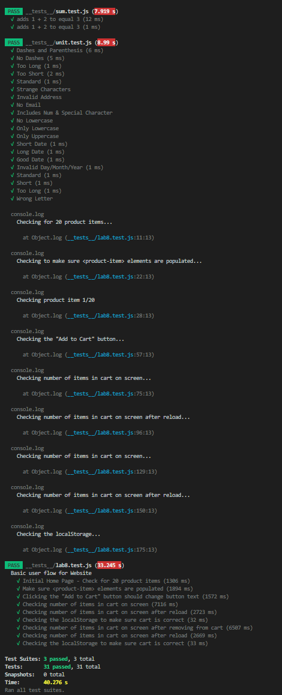

# Lab 8 - Starter

1. Within a GitHub action whenever code is pushed. It's important to continually test as you are writing code and not just once everything is done. Automated test should not be run manually. GitHub actions can do this. 
2. No
3. No, I'd use an E2E test. 
4. Yes. This works best with unit testing.

